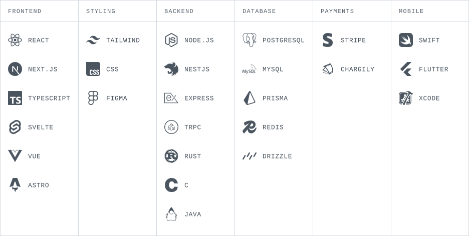

# Hi, I'm Mehdi

**Web developer · Algeria**

I build fast, interactive web experiences with a focus on motion, thoughtful interfaces, and performance.

Currently working with **Thinkercare Group** and deepening my skills in **JavaScript** and **Svelte**. I also work with **React** and **Next.js**.

[Portfolio](https://mehdios.vercel.app) · [LinkedIn](https://www.linkedin.com/in/mehdi-djahraoui-134bb6389/) · [Instagram](https://www.instagram.com/mehdi.tsx/)

### Tech stack

  <picture>
    <source media="(max-width: 600px) and (prefers-color-scheme: dark)" srcset="./assets/tech-stack-dark-mobile.svg" />
    <source media="(max-width: 600px) and (prefers-color-scheme: light)" srcset="./assets/tech-stack-light-mobile.svg" />
    <source media="(max-width: 1000px) and (prefers-color-scheme: dark)" srcset="./assets/tech-stack-dark-tablet.svg" />
    <source media="(max-width: 1000px) and (prefers-color-scheme: light)" srcset="./assets/tech-stack-light-tablet.svg" />
    <source media="(prefers-color-scheme: dark)" srcset="./assets/tech-stack-dark.svg" />
    <source media="(prefers-color-scheme: light)" srcset="./assets/tech-stack-light.svg" />
    
  </picture>

### GitHub activity

<!-- stats-updated:start -->
Updated 2026-10-04 19:36 UTC · Scheduled hourly.
<!-- stats-updated:end -->

  <picture>
    <source media="(prefers-color-scheme: dark)" srcset="./assets/stats-dark.svg?v=58d7e4e13b2ba815" />
    <source media="(prefers-color-scheme: light)" srcset="./assets/stats-light.svg?v=58d7e4e13b2ba815" />
    
  </picture>

[Yearly snapshots and metric definitions](./stats/README.md)

Yearly contributions match the GitHub calendar, including shared private activity counts. Public commits are shown separately.

  <picture>
    <source media="(prefers-color-scheme: dark)" srcset="./assets/streak-dark.svg?v=58d7e4e13b2ba815" />
    <source media="(prefers-color-scheme: light)" srcset="./assets/streak-light.svg?v=58d7e4e13b2ba815" />
    
  </picture>

  <picture>
    <source media="(prefers-color-scheme: dark)" srcset="./assets/languages-dark.svg?v=58d7e4e13b2ba815" />
    <source media="(prefers-color-scheme: light)" srcset="./assets/languages-light.svg?v=58d7e4e13b2ba815" />
    
  </picture>

Daily contribution streaks · Languages by code size in public repositories.

---

Away from the keyboard: traveling, exploring food, hiking, swimming, and reading.
