# 2026 GitHub stats snapshot

Last saved: **2026-10-01T21:50:31Z** (UTC).

<picture>
  <source media="(prefers-color-scheme: dark)" srcset="./stats-dark.svg" />
  <source media="(prefers-color-scheme: light)" srcset="./stats-light.svg" />
  
</picture>

[All years](../README.md) · [Snapshot data](./snapshot.json)

- **Contributions:** the calendar-year total shown on the public GitHub profile, including private contribution counts the owner has chosen to make visible. This includes qualifying commits and other activity such as pull requests, issues, reviews, and repository creation.
- **Public commits:** only the public commit contributions in that calendar year. This is a subset of the contribution total, not the total number of all public and private commits.
- **Stars, PRs, and issues:** cumulative public totals at the time of capture.
- **Contributed repositories:** the provider's trailing-year count, excluding owned repositories by default.
- **Rank:** the provider's GitHub Readme Stats score, based on its public stats. Adding the calendar contribution total does not change this score.

These are yearly snapshots, not annual totals for every metric. An active year
is scheduled to update hourly; completed years keep their last successful snapshot and its date.
Tracking starts with the first saved snapshot. Years before that are not backfilled.

[How GitHub counts contributions](https://docs.github.com/en/account-and-profile/reference/profile-contributions-reference) · [Other metric definitions](https://github-stats-extended.vercel.app/frontend/docs/cards/stats/)
